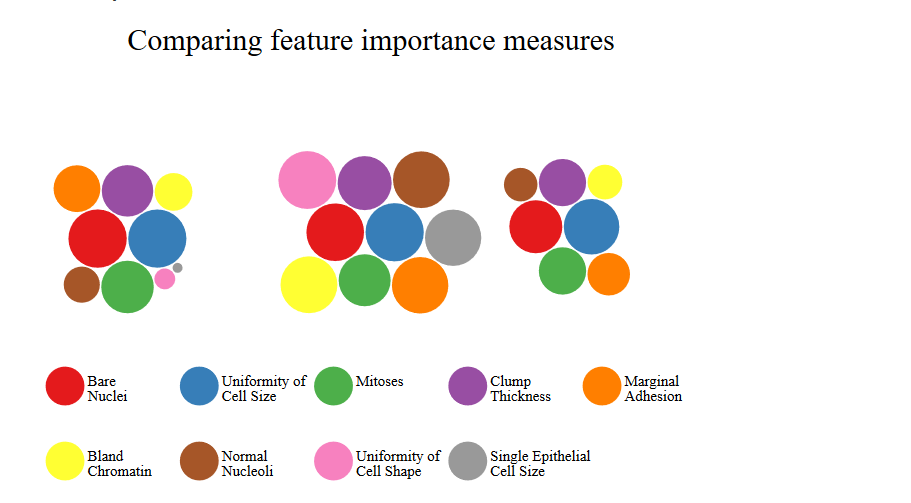

Paneled Bubble chart
================

# Why paneled bubble chart?

Bubble chats are fun\! They are useful for comparing many different
categories. They can also help engage your audience when your
report/presentation/dashboard is swamped by the monopoly of bar charts
or whatnot. Even though bubble charts are not the best way to visualize
quantitative differences, since comparing area is hard for our human
brains, that should not stop us from drawing bubbles with comparable
sizes across figures. Most (all?) bubbles charts are powered by D3.js, a
JavaScript library. The challenge is that bubble sizes are determined
dynamically based on the size of the figure and the packing pattern in
D3, and the same data can be represented by different sizes if you
change the order across figures. Thus, there is no straightforward way
to make multiple bubbles charts with a shared scale. This is what this
project aimed to achieve.

## How to scale multiple bubble charts?

At a high level, the key is to obtain the mapping functions between the
data and the bubble sizes, and to scale each figure such that they all
share the same mapping function. For example, imagine we want to
visualize weights of seeds across grains species, and the radius of a
bubble corresponds to the seed weight. If the weight of 1g corresponds
to a radius of 100 pixels in panel 1, while the same weight corresponds
to a radius of 150 pixels in panel 2. The two panels can be made to
share the same scale if we enlarge panel 1 by 1.5 or shrink panel 2 by
1.5.

## Built with

  - R
  - R2D3
  - D3.js

## Features

  - D3 code template to make paneled bubble charts.
  - R function to interface with the D3 code template
  - Requires *only R* knowledge to use

## How to use?

This project was designed for R users without JavaScript experience, and
you can manipulate your data and interface with the D3.js through R
entirely. After downloading the “bubblesprojecttemplate.zip”, change the
file name and extension of “bubbles\_txt.txt” to “bubbles.js”, and then
open the “bubbles\_r2d3.R” for instructions on how to use the function
and a minimal example. The utility of the R function depends on two
other R libraries: R2D3 which allows interfacing between R and D3.js;
and dplyr for data manipulation. All the graphical components are
written in D3. If you want to customize the figure to your needs, please
check out the file “bubbles.js”.

## Example:



Here the three panels compare different ways to understand relative
importance of nine biopsy output in predicting breast cancer: feature
importance from a logistic regression model with all nine features,
model performance with each feature alone, and feature importance of a
reduced model after backward elimination. As you can see, the first and
third panel are essentially the same. But the middle panel shows that
each feature has high predictive power alone. I did the analysis in
Python to practice my data science skills. Please check the Jupyter
Notebook for more information about the data and analysis.

## Here is the code I used to make the figure here

``` r
# read in the data
dat = read.csv("feature_importance.csv")

# scale the columns such that the relative importance can be compared
# and add font size, color, lable and alpha columns
data_feature =  dat %>% 
  mutate(size = importance/max(importance),
         single_model = single_importance/max(single_importance),
         reduced_model = importance_r/max(importance_r, na.rm=T),
         font_size = 12) %>% 
  arrange(desc(size)) %>% 
  mutate(color = c("#e41a1c", "#377eb8", "#4daf4a", "#984ea3",
                   "#ff7f00", "#ffff33", "#a65628", "#f781bf", "#999999"), 
         lable = " ",
         alpha = 1)
  

# set NAs to be zero
data_feature[is.na(data_feature)] <- 0

# specify the legend information:

data_legend <-
  data.frame(id = 1:9,
             X = c(1,2,3,4,5,1,2,3,4), 
             Y = c(1,1,1,1,1,2,2,2,2),
             color = data_feature$color,
             Lable = data_feature$feature)
```

``` r
r2d3(data = list(data = data_feature,
                 data2 = data_feature %>% rename(full_model = size, size = single_model),
                 data3 = data_feature %>% rename(full_model = size, size = reduced_model),
                 data4 = data_feature,
                 legend = data_legend,
                 panel_number = 3, 
                 key = "feature",
                 radius = "size",
                 color = "color",
                 alpha = "alpha",
                 lable_name = "lable",
                 font_size = "font_size",
                 font_size_title = 30,
                 font = "Times New Roman",
                 font_color = "#000000", 
                 title = "Comparing feature importance measures",
                 legend_bubble_size = 30,
                 legend_spacing = 30), 
     script = "bubbles.js",
     viewer = "internal")
```
